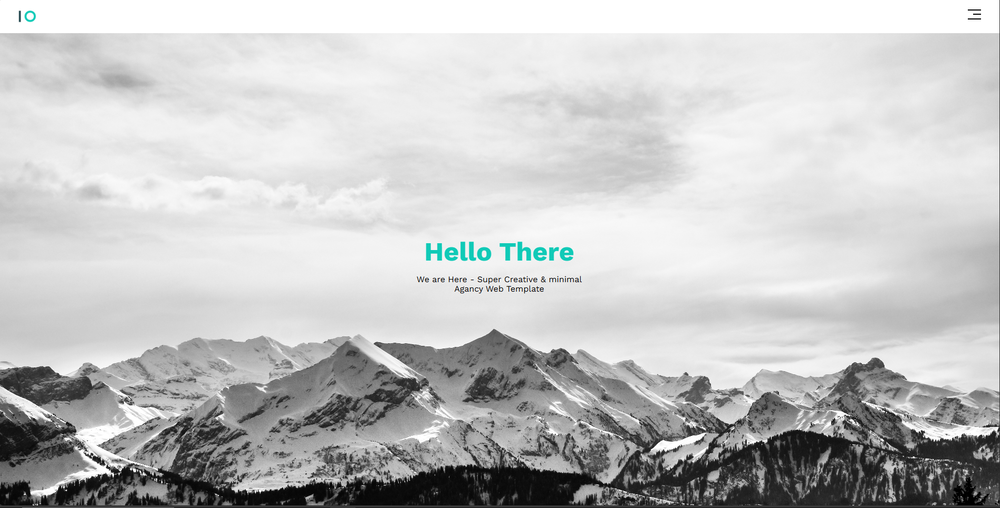

# Responsive Landing Page Template

A modern and minimal **landing page template** built using only **HTML5** and **CSS3**. Ideal for creative agencies, freelancers, and personal branding websites.

## 📸 Live Demo

[📦 GitHub Repo]([https://github.com/your-username/leon-template](https://lnkd.in/dtrzgwFx))

---

## 🚀 Features

- 💻 Fully responsive layout (mobile-friendly)
- 🎨 Clean and modern UI design
- 🔧 Built with HTML5 + CSS3 (Flexbox, Grid, Variables)
- 📚 Google Fonts & Font Awesome icons
- ⚡️ Fast loading, no JavaScript required

---

## 🛠️ Technologies Used

- HTML5
- CSS3 (Grid, Flexbox, Media Queries)
- Google Fonts
- Font Awesome

---

## 📌 Screenshots

| Landing Section | Services Section |
|-----------------|------------------|
|  |  |

---

## 🤝 Contributing

Feel free to fork this repo, improve it, and submit pull requests. Feedback and suggestions are welcome!

---

## 📫 Contact

Created by **Ferhat Osman**  
📧 Email: ferhatware@gmail.com

